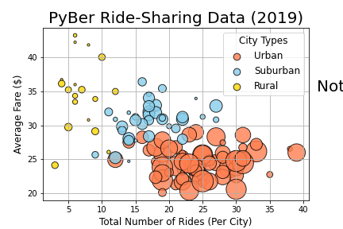
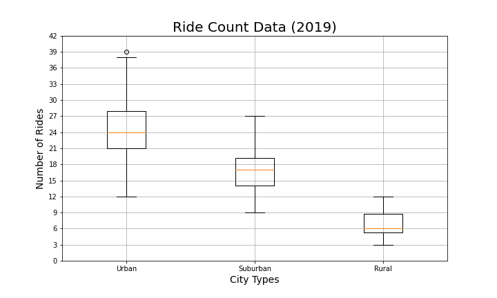
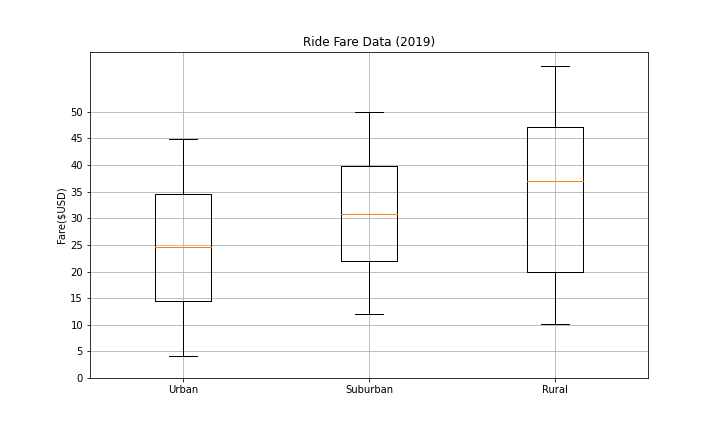
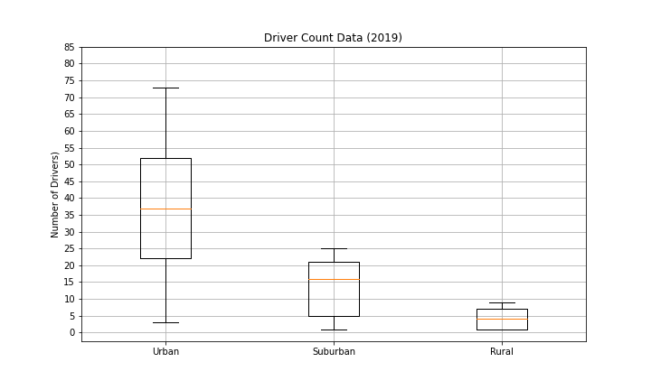
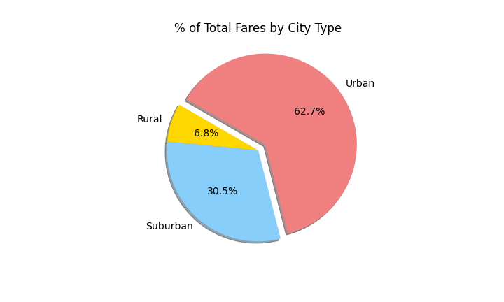
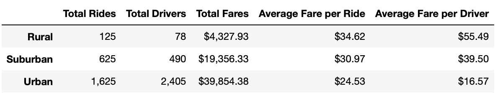
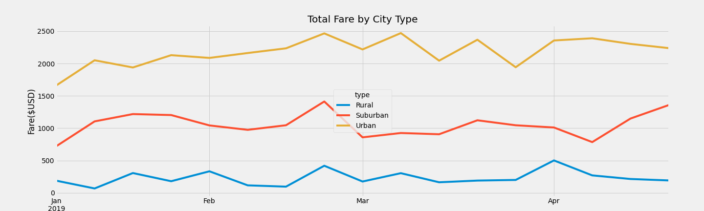

# PyBer_Analysis

### Resources
* Python 3.9.0, 
* Anaconda Navigator 1.9.12,
* Jupyter notebook 6.0.3,
* Pandas, NumPy, Matplotlib
* Data Source: PyBer_ride_data.csv

## Project Overview

we have here a rideshare platform's -Pyber- data from January to early May of 2019, we are asked to gather insight to help improve access to under-served areas and determine better pricing. 

### visualizing

we can see that there is 3 type of cities served by the app, we are going to generate insight based on the three city types

1- quick general look at the data.

* We can see that Urban cities make up most of the rides and generate the most money.

2- Ride Count Data

* There is one outlier in the urban ride count data. Also, the average number of rides in the rural cities is about 4- and 3.5-times lower per city than the urban and suburban cities, respectively.

3- Ride Fare Data

* From this box-and-whisker plots, we see that there are no outliers. However, the average fare for rides in the rural cities is about $11 and $5 more per ride than the urban and suburban cities, respectively. 

4- Driver Count Data

* The average number of drivers in rural cities is nine to four times less per city than in urban and suburban cities, respectively

5- Percentage of Fares by City type

* Urban cities make up over 62% of the fares

### Results

In the next part we try to see how different types of cities performed over time,
to do so we have created a summary table that shows information about the rides, the fares and the drivers based on the type of city.

* Ride sharing summary per city type.

looking at the table above we can quickly see that:

- As stated before we can see that **Urban cities make up the most rides and money and employ the most drivers**.
- There are around thirty times as many **rural** drivers, and around five times as many **suburban** drivers in the **Urban** cities.
- Average fare per ride and Average fare per driver for the **rural** cities is higher than any other city type

next we create a chart detailing the total fares per city type over Time.

### Summary

* **rural cities** average a much higher fare per ride and Per driver, we can assume that the rural trips would be longer compared to urban trips which could be shorter on average.. too bad we don’t have data about the distance of trips to answer this question.

* the **rural cities** make up only a small percentage of the total rides recorded, its wise to try to target that market better.

* the average fare per driver is lower than average fare per ride for **Urban cities**, -which is already the lowest in its category- we can suspect that very short trips leave the drivers with very little money in urban cities. maybe a better pricing method should be adopted for the driver well being.

